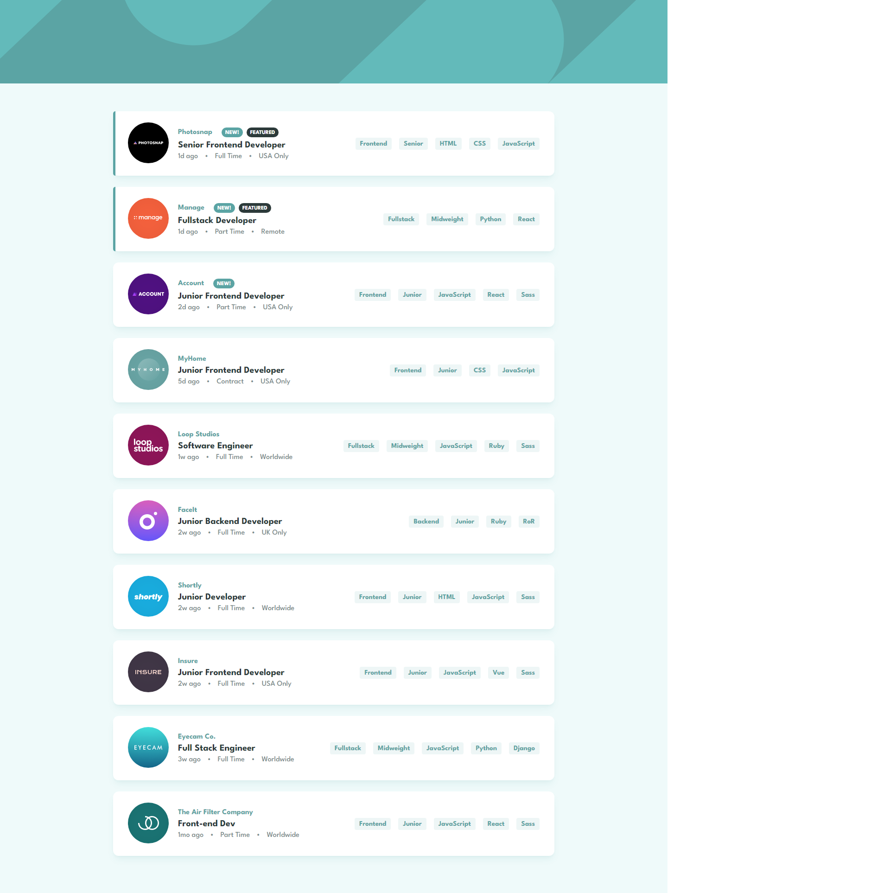

# Frontend Mentor - Job listings with filtering solution

This is a solution to the [Job listings with filtering challenge on Frontend Mentor](https://www.frontendmentor.io/challenges/job-listings-with-filtering-ivstIPCt). Frontend Mentor challenges help you improve your coding skills by building realistic projects. 

## Table of contents

- [Frontend Mentor - Job listings with filtering solution](#frontend-mentor---job-listings-with-filtering-solution)
  - [Table of contents](#table-of-contents)
  - [Overview](#overview)
    - [The challenge](#the-challenge)
    - [Screenshot](#screenshot)
    - [Links](#links)
  - [Built with](#built-with)
  - [Author](#author)

## Overview

### The challenge

Users should be able to:

- View the optimal layout for the site depending on their device's screen size
- See hover states for all interactive elements on the page
- Filter job listings based on the categories

### Screenshot

### Links

- Solution URL: [Solution](https://www.frontendmentor.io/solutions/job-listing-page-fcONfsqI2O)
- Live Site URL: [Website](https://mianazan099.github.io/Static-Job-Listings/)

## Built with

- HTML
- CSS
- JavaScript

## Author

- Website - [Mian Azan](https://www.mianazan.com)
- Frontend Mentor - [@mianazan099](https://www.frontendmentor.io/profile/mianazan099)
